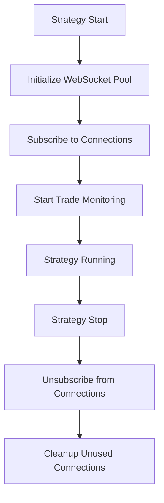
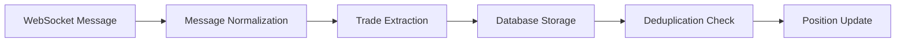

# WebSocket Integration Guide

## Overview

The trading bot system now includes a comprehensive WebSocket integration that automatically connects to private WebSocket streams for all exchanges when strategies are running. This ensures real-time trade data is captured and stored in the database without duplication or confusion.

## Key Features

### 🔄 **Centralized Connection Pool**
- **One connection per exchange type**: Only one WebSocket connection per exchange/market combination (e.g., `binance_spot`, `binance_future`, `bybit_spot`)
- **Connection sharing**: Multiple strategies can share the same WebSocket connection
- **Automatic cleanup**: Connections are closed when no strategies are using them

### 📊 **Real-time Trade Monitoring**
- **Automatic trade capture**: All trade executions are captured via WebSocket and stored in PostgreSQL
- **Deduplication**: Uses the same deduplication system as the enhanced trade sync
- **Comprehensive logging**: All WebSocket trade operations are logged via the trade sync logger

### 🔧 **Strategy Integration**
- **Automatic activation**: WebSocket monitoring starts automatically when strategies start
- **Transparent operation**: Strategies don't need to manage WebSocket connections manually
- **Clean shutdown**: WebSocket connections are properly cleaned up when strategies stop

## Architecture

### Connection Pool Structure

```
WebSocketConnectionPool
├── connections: Dict[str, ConnectionInfo]
│   ├── "binance_spot" → ConnectionInfo
│   ├── "binance_future" → ConnectionInfo  
│   ├── "bybit_spot" → ConnectionInfo
│   └── "bybit_future" → ConnectionInfo
├── strategy_subscriptions: Dict[str, Set[str]]
│   ├── "strategy_1" → {"binance_spot", "bybit_spot"}
│   └── "strategy_2" → {"binance_spot", "binance_future"}
└── trade_sync_logger: TradeSyncLogger
```

### Connection Key Format

Each WebSocket connection is identified by a unique key:
- **Format**: `{exchange_name}_{market_type}`
- **Examples**: 
  - `binance_spot` (Binance spot trading)
  - `binance_future` (Binance futures/perpetuals)
  - `bybit_spot` (Bybit spot trading)
  - `bybit_future` (Bybit derivatives)

### Market Type Detection

The system automatically detects market types from exchange connectors:

```python
def _get_market_type(self, connector: BaseExchangeConnector) -> str:
    # Check for market_type attribute
    if hasattr(connector, 'market_type'):
        if market_type in ['future', 'futures']:
            return 'future'
        elif market_type in ['perpetual', 'perp']:
            return 'perpetual'
        else:
            return 'spot'
    
    # Check class name and underlying exchange
    # Default to 'spot'
```

## Strategy Integration

### Automatic WebSocket Activation

When a strategy starts, the base strategy class automatically:

1. **Initializes connection pool** (if not already running)
2. **Subscribes to WebSocket connections** for all strategy exchanges
3. **Starts real-time trade monitoring**
4. **Logs connection status**

```python
async def _start_websocket_monitoring(self) -> None:
    """Start WebSocket connections for real-time trade monitoring."""
    # Ensure connection pool is running
    if not self.websocket_pool._running:
        await self.websocket_pool.start()
    
    # Subscribe strategy to WebSocket connections
    success = await self.websocket_pool.subscribe_strategy(
        strategy_id=self.instance_id,
        exchange_connectors=self.exchange_connectors,
        symbols=[self.symbol]
    )
```

### Strategy Lifecycle



## Supported Exchanges

### Private WebSocket Endpoints

| Exchange | Spot Endpoint | Futures Endpoint |
|----------|---------------|------------------|
| **Binance** | `wss://stream.binance.com:9443/ws` | `wss://fstream.binance.com/ws` |
| **Bybit** | `wss://stream.bybit.com/v5/private` | `wss://stream.bybit.com/v5/private` |
| **MEXC** | `wss://wbs.mexc.com/ws` | `wss://contract.mexc.com/ws` |
| **Gate.io** | `wss://api.gateio.ws/ws/v4/` | `wss://fx-ws.gateio.ws/v4/ws` |
| **Bitget** | `wss://ws.bitget.com/spot/v1/stream` | `wss://ws.bitget.com/mix/v1/stream` |
| **Hyperliquid** | N/A | `wss://api.hyperliquid.xyz/ws` |

### Authentication Methods

| Exchange | Authentication Method | Details |
|----------|----------------------|---------|
| **Binance** | Listen Key | Uses `listenKey` endpoint for private streams |
| **Bybit** | API Signature | HMAC-SHA256 signature authentication |
| **MEXC** | API Signature | HMAC-SHA256 with timestamp |
| **Gate.io** | API Signature | HMAC-SHA512 signature |
| **Bitget** | API Signature | Base64 encoded HMAC-SHA256 with passphrase |
| **Hyperliquid** | Wallet Address | Uses wallet address for user subscriptions |

## Trade Message Processing

### Message Flow



### Message Types Handled

1. **Order Updates** (`ORDER_UPDATE`)
   - Order fills and partial fills
   - Order status changes
   - Account balance updates

2. **Trade Messages** (`TRADE`)
   - Direct trade execution messages
   - User-specific trade data

### Trade Data Conversion

WebSocket messages are converted to standardized trade format:

```python
{
    'id': 'trade_id',
    'order_id': 'order_id',
    'symbol': 'BERA/USDT',
    'side': 'buy',
    'amount': 100.0,
    'price': 2.45,
    'cost': 245.0,
    'timestamp': 1733400000000,
    'fee': {
        'cost': 0.1,
        'currency': 'USDT'
    }
}
```

## Connection Management

### Connection Sharing Example

```python
# Strategy 1 starts
strategy_1 = PassiveQuotingStrategy(...)
strategy_1.exchange_connectors = {
    'binance_spot': binance_spot_connector,
    'bybit_spot': bybit_spot_connector
}
await strategy_1.start()
# Creates: binance_spot, bybit_spot connections

# Strategy 2 starts (shares binance_spot)
strategy_2 = AnotherStrategy(...)
strategy_2.exchange_connectors = {
    'binance_spot': binance_spot_connector,  # Reuses existing
    'binance_future': binance_future_connector  # Creates new
}
await strategy_2.start()
# Reuses: binance_spot, Creates: binance_future

# Strategy 1 stops
await strategy_1.stop()
# Keeps: binance_spot (still used by strategy_2)
# Closes: bybit_spot (no more subscribers)

# Strategy 2 stops  
await strategy_2.stop()
# Closes: binance_spot, binance_future (no more subscribers)
```

### Connection Status Monitoring

```python
# Get connection pool status
pool = get_connection_pool()
status = pool.get_connection_status()

print(f"Total connections: {status['total_connections']}")
print(f"Total strategies: {status['total_strategies']}")

for conn_key, conn_info in status['connections'].items():
    print(f"{conn_key}: {conn_info['status']} ({conn_info['subscriber_count']} subscribers)")
```

## Configuration

### WebSocket Manager Configuration

```python
ws_config = {
    'ping_interval': 30.0,      # Seconds between ping messages
    'pong_timeout': 10.0,       # Seconds to wait for pong response
    'reconnect_enabled': True,   # Enable automatic reconnection
    'max_message_size': 10485760 # 10MB max message size
}
```

### Connection Pool Initialization

```python
from exchanges.websocket import initialize_connection_pool, shutdown_connection_pool

# Initialize (usually done automatically by strategies)
pool = await initialize_connection_pool()

# Shutdown (usually done automatically)
await shutdown_connection_pool()
```

## Testing

### Running WebSocket Integration Tests

```bash
# Test the WebSocket connection pool
python test_websocket_integration.py
```

### Test Coverage

The test suite verifies:

1. **Single strategy subscription**
2. **Multiple strategies sharing connections**
3. **Strategy unsubscription and cleanup**
4. **Full connection pool lifecycle**
5. **Strategy integration with WebSocket monitoring**

## Logging and Monitoring

### Trade Sync Logging

All WebSocket trade operations are logged using the trade sync logger:

```python
# Trade fetch start
self.trade_sync_logger.log_trade_fetch_start(
    exchange_name, symbol, 'websocket'
)

# Trade storage
self.trade_sync_logger.log_trade_storage(
    exchange_name, symbol, count, duplicates, 'websocket'
)
```

### Log Files

- **Trade sync logs**: `logs/trade_sync/trade_sync_YYYYMMDD_HHMMSS.log`
- **WebSocket logs**: Integrated with main application logging

### Monitoring Connection Health

```python
# Check individual connection status
status = ws_manager.get_connection_status(conn_id)
print(f"State: {status['state']}")
print(f"Last message: {status['last_message']}")
print(f"Error: {status['error']}")
```

## Best Practices

### 1. Strategy Design
- ✅ **Inherit from BaseStrategy** to get automatic WebSocket integration
- ✅ **Let the base class handle WebSocket lifecycle**
- ❌ **Don't manually manage WebSocket connections in strategies**

### 2. Connection Management
- ✅ **Use the global connection pool** via `get_connection_pool()`
- ✅ **Trust the automatic cleanup** when strategies stop
- ❌ **Don't create multiple connection pools**

### 3. Error Handling
- ✅ **Monitor connection status** for debugging
- ✅ **Check trade sync logs** for WebSocket trade processing
- ✅ **Handle strategy startup failures** gracefully

### 4. Testing
- ✅ **Test with mock connectors** for development
- ✅ **Verify connection sharing** works correctly
- ✅ **Test cleanup behavior** when strategies stop

## Troubleshooting

### Common Issues

1. **No WebSocket connections created**
   - Check if exchange connectors are properly configured
   - Verify API credentials are valid
   - Check WebSocket endpoint URLs

2. **Duplicate trade messages**
   - Verify only one connection per exchange type
   - Check deduplication system is working
   - Review trade sync logs

3. **Connection not cleaned up**
   - Ensure strategies are properly stopped
   - Check for unhandled exceptions in strategy lifecycle
   - Monitor connection pool status

### Debug Commands

```python
# Check connection pool status
pool = get_connection_pool()
status = pool.get_connection_status()
print(json.dumps(status, indent=2))

# Check strategy subscriptions
for strategy_id, connections in status['strategies'].items():
    print(f"Strategy {strategy_id}: {connections}")

# Check individual connection health
for conn_key, conn_info in status['connections'].items():
    print(f"{conn_key}: {conn_info['status']} - {conn_info['error']}")
```

## Future Enhancements

### Planned Features

1. **Public WebSocket Support**
   - Market data streams (orderbook, trades)
   - Price feed integration

2. **Advanced Monitoring**
   - Connection health metrics
   - Message rate monitoring
   - Latency tracking

3. **Enhanced Error Recovery**
   - Automatic credential refresh
   - Smart reconnection strategies
   - Circuit breaker patterns

4. **Performance Optimization**
   - Message batching
   - Compression support
   - Connection pooling improvements

---

## Summary

The WebSocket integration provides a robust, scalable solution for real-time trade monitoring across multiple exchanges and strategies. By centralizing connection management and ensuring proper cleanup, the system prevents trade duplication and confusion while providing comprehensive trade data capture.

**Key Benefits:**
- ✅ **No duplicate connections** per exchange type
- ✅ **Automatic trade capture** and database storage  
- ✅ **Seamless strategy integration** with minimal code changes
- ✅ **Comprehensive logging** and monitoring
- ✅ **Proper resource cleanup** and error handling 